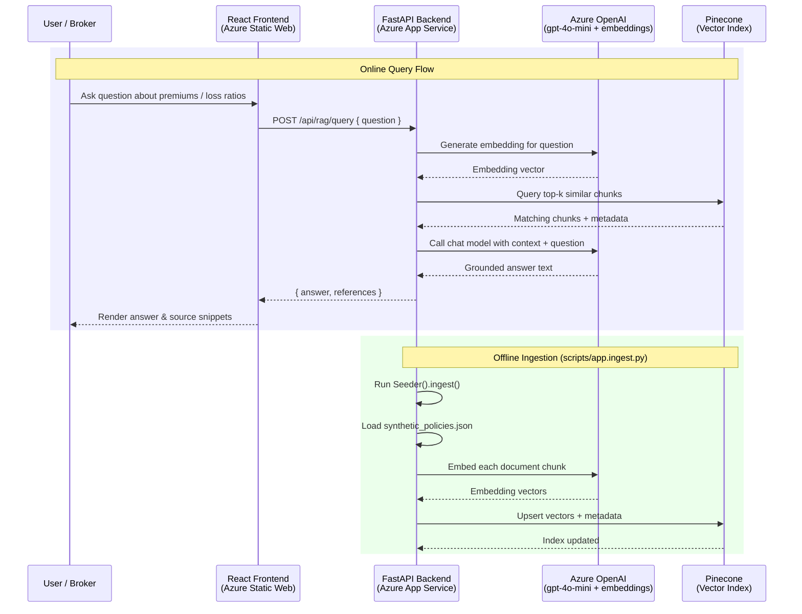

## FinRAG POC

End-to-end Retrieval Augmented Generation (RAG) proof of concept for a global insurance organization. The stack combines a FastAPI backend, React/Vite frontend, Pinecone vector search, and Azure-managed services deployed through Terraform and released via Azure DevOps.

### Architecture Highlights



- **Frontend**: React + Vite single-page app served from Azure Storage static website fronted by Azure CDN (optional) with MSAL hooks for corporate SSO.
- **Backend**: FastAPI hosted on Azure App Service (Linux). Uses managed identity to call Azure OpenAI and securely obtains Pinecone credentials from Key Vault (stubbed for PoC).
- **LLM & Retrieval**: Azure OpenAI `gpt-4o-mini` for responses and `text-embedding-3-large` for vectorization. Pinecone hosts insurance document embeddings.
- **Data Plane**: Placeholder ingestion script chunks synthetic transactional docs and upserts embeddings into Pinecone.
- **IaC**: Terraform config under `infra/terraform` provisions the RG, OpenAI, storage, App Service, App Insights, Log Analytics, and an Azure DevOps service connection.
- **CI/CD**: `devops/azure-pipelines.yml` defines build, infrastructure, and deployment stages with manual approval gates.

### Repository Layout
- `frontend/` – React UI (Vite, TypeScript) with a `RagChat` component calling the backend.
- `backend/` – FastAPI app (`app/main.py`) plus `rag_pipeline.py` orchestrating Azure OpenAI + Pinecone, and `ingest.py` for data loading.
- `data/` – `synthetic_policies.json` sample dataset for PoC ingestion.
- `infra/terraform/` – Terraform modules for Azure + Azure DevOps resources.
- `devops/azure-pipelines.yml` – Multi-stage Azure DevOps YAML pipeline.

### Azure Services Used

| Service | Logo | Purpose in this PoC |
|--------|------|---------------------|
| **Azure Resource Group** |  | Logical container for all Azure resources (compute, storage, observability, OpenAI). |
| **Azure Storage (Static Website)** |  | Hosts the built React/Vite frontend as a static site in the `$web` container. |
| **Azure App Service (Linux)** |  | Runs the FastAPI backend with a Linux App Service Plan, exposing the `/api/rag/query` endpoint. |
| **Managed Identity (System-assigned)** |  | Allows the backend to authenticate to Azure OpenAI without storing keys or secrets. |
| **Azure OpenAI (Cognitive Services)** |  | Provides `gpt-4o-mini` for answers and `text-embedding-3-large` for vector embeddings. |
| **Log Analytics Workspace** |  | Central store for logs and metrics collected from Application Insights. |
| **Application Insights** |  | Observability for the backend (APM, traces, availability). |
| **Azure AD / Entra ID (App + SP)** |  | App registration + service principal used by Azure DevOps service connection. |
| **Azure DevOps (Project + Pipelines)** |  | Hosts the Git repo, YAML pipelines, and the Azure service connection used to run Terraform and deploy the app. |

### Local Development
1. **Frontend**
   ```bash
   cd frontend
   npm install
   npm run dev
   ```
   Configure `VITE_API_BASE_URL` in `.env` to point at the FastAPI URL.

2. **Backend**
   ```bash
   cd backend
   python -m venv .venv
   source .venv/bin/activate
   pip install -r requirements.txt
   uvicorn app.main:app --reload
   ```
   Export Azure OpenAI & Pinecone env vars or load via `.env`.

3. **Data Ingestion**
   ```bash
   cd backend
   python -m app.ingest
   ```
   Populates Pinecone with sample documents from `data/synthetic_policies.json`.

### Terraform Deployment
1. Copy `infra/terraform/terraform.tfvars.example` ➜ `terraform.tfvars` and fill values (region, DevOps org/project, PAT, etc.).
2. Configure AzureRM backend (remote state) or let Terraform default to local.
3. Run:
   ```bash
   cd infra/terraform
   terraform init
   terraform plan
   terraform apply
   ```
4. Outputs expose the App Service URL, static site endpoint, and OpenAI endpoint for connecting the app.

### Azure DevOps Pipeline
1. Import this repo into your Azure DevOps project or connect via service connection.
2. Create secret variables referenced in `devops/azure-pipelines.yml` (e.g., `FINRAG_SERVICE_CONNECTION`, `WEBAPP_NAME`, `STORAGE_ACCOUNT`, TF backend settings).
3. Queue the pipeline:
   - **BuildTest stage**: lint/tests for backend, build for frontend.
   - **DeployInfra**: Installs Terraform, runs plan, waits for manual approval, then applies.
   - **DeployApp**: Packages backend to zip > deploy to App Service, uploads frontend assets to Storage static site.

### Security Notes
- FastAPI App Service runs with system-assigned managed identity; Terraform grants `Cognitive Services OpenAI User` role.
- Azure DevOps gets its own Azure AD service principal; Terraform mints a 1-year credential and wires it into the service connection automatically.
- Pinecone API key injected via Key Vault (to be wired in production); `.env` usage here is for local testing only.

### Next Steps
- Integrate Azure API Management or Front Door for zero-trust ingress.
- Replace static dataset with ingestion from Azure Storage or Cosmos DB plus Azure Functions event triggers.
- Add integration tests validating retrieval-grounded answers using contract tests in CI/CD.

### High-Level Architecture Diagram

```mermaid
flowchart LR
    subgraph Azure
      A[Developer / Broker\nWeb Browser] --> B[Azure Storage Static Website\n(React / Vite Frontend)]
      B -->|HTTPS / JSON| C[Azure App Service (Linux)\nFastAPI Backend + Managed Identity]

      subgraph AzureOpenAI[Azure OpenAI]
        D1[gpt-4o-mini\nChat/Completion]
        D2[text-embedding-3-large\nEmbedding]
      end

      C -->|Managed Identity / AAD| AzureOpenAI

      subgraph Observability
        E[Log Analytics Workspace]
        F[Application Insights]
      end

      C --> F
      F --> E
    end

    C -->|HTTPs + API key| G[(Pinecone\nVector Index)]

    subgraph AzureDevOps[Azure DevOps]
      H[Azure DevOps Project\n(Repos + Pipelines)]
      I[Service Connection\n(Azure AD Service Principal)]
    end

    H -->|CI/CD\nAzure Pipelines| C
    H -->|Static Build Artifacts| B
    H -->|Terraform Plan/Apply| Azure
```